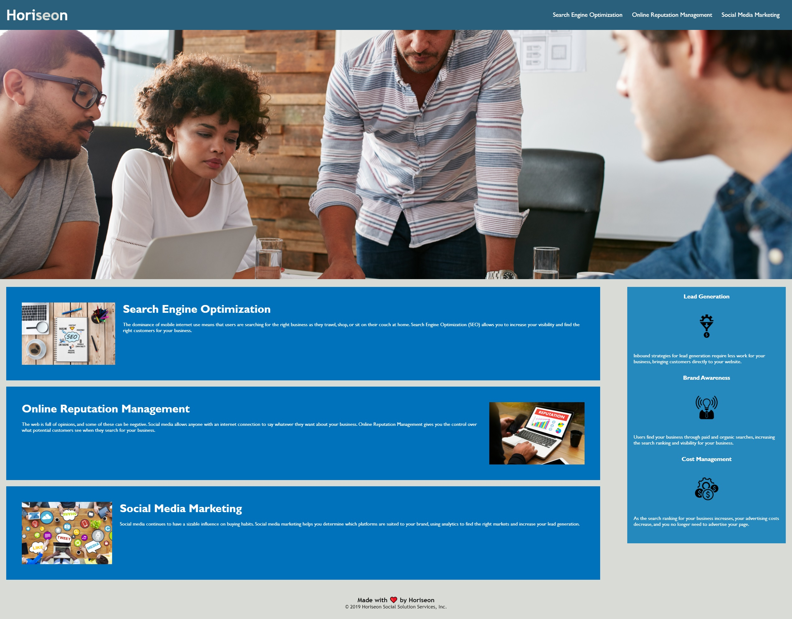

# Horiseon Webpage Code Refactor

Horiseon is a marketing agency that provides services for clients, including Search Engine Optimization, Online Reputation Management, and Social Media Marketing.

Horiseon has asked to review and update the code for their website to follow accessability standards, making the site optimized for search engines.

## Horiseon Webpage



## User Acceptance Criteria

```
GIVEN a webpage meets accessibility standards
WHEN I view the source code
THEN I find semantic HTML elements
WHEN I view the structure of the HTML elements
THEN I find that the elements follow a logical structure independent of styling and positioning
WHEN I view the image elements
THEN I find accessible alt attributes
WHEN I view the heading attributes
THEN they fall in sequential order
WHEN I view the title element
THEN I find a concise, descriptive title
```

## Summary of changes

Both index.html and style.css were modified to provide clean code with comments of changes. The website has been modified to meet accessability standards.

The CSS file was modified to consolidate classes and remove duplicate code.

### Changes to index.html

- Changed the title of the webpage for optimized search engine results. Title is also more descriptive
- Added a header element tag to designate the content in the header of the page (This includes the company header as well as the navigation bar)
- Added nav element tag to designate the navigation bar on the page
- Added a section element tag to designate the main content of the page. This tag also contains numerous nested section tags to further organize content
- Added a section element tags with the class "services" to organize each service Horiseon offers clients (Search Engine Optimization, Online Reputation Management, and Social Media Marketing)
- Added alternative text for each image under each service to meet accessability standards
- Added an aside element tag for the benefit information on the right side of the page
- Added section tags for each of the benefit content in the aside (Lead Generation, Brand Awareness, and Cost Management)
- Added alternative text for the images for each section
- Cleaned up the image closing tag to a self-closing tag to standardize the code with the other image tags on the page
- Added a footer tag to the footer section of the page to meet accessability requirements

### Changes to style.css

- Changed the .div classes to .nav class to match the html semantic elements in index.html
- Consolidated .header nav ul li code to include all styling for the navigation bar in the heading of the page. This removed an extra class that was not needed (.header div ul)
- Consolidated multiple classes (.benefit-lead, .benefit-brand, and .benefit-cost) into a single class (.benefit), removing duplicate code
- Consolidated multiple h3 classes (.benefit-lead h3, .benefit-brand h3, and .benefit-cost h3) into a single class (.benefit h3)
- Consolidated multiple img classes (.benefit-lead img, .benefit-brand img, and .benefit-cost img) into a single class (.benefit img)
- Consolidated multiple classes (.search-engine-optimization, .online-reputation-management, and .social-media-marketing) into a single class (.services)
- Consolidated multiple img classes (.search-engine-optimization img, .online-reputation-management img, and .social-media-marketing img) into a single class (.services img)
- Consolidated multiple h2 classes (.search-engine-optimization h2, .online-reputation-management h2, and .social-media-marketing h2) into a single class (.services h2)
